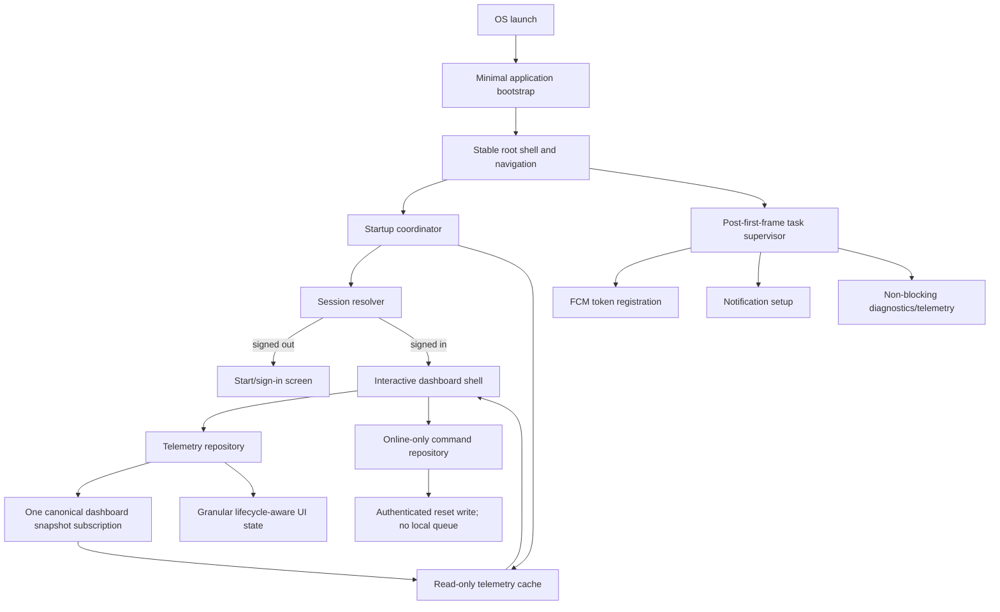

# GARBY Mobile App Startup Architecture Rework Plan

**Document owner:** Senior Development  
**Date:** 2026-08-24  
**Status:** Proposed  
**Scope:** Android application startup through an interactive dashboard  
**Decision constraint:** The existing startup flow will not receive another optimization pass. This plan replaces the startup architecture incrementally.

## Executive summary

The startup lag is primarily network- and architecture-bound, not device-bound. A faster CPU or GPU cannot remove a launch dependency that deliberately waits as long as five seconds for a Firebase socket; when the socket connects within that window, the flow adds another 300 ms before routing. After routing, the dashboard creates 13 Realtime Database listeners and processes their initial callbacks as separate whole-screen state changes. The app also performs Firebase/FCM and connectivity work at process creation, requests the FCM token through two paths, has no usable read cache, and does not measure time to full display.

The target architecture will:

- render a stable, interactive app shell without waiting for a network connection;
- separate session resolution, telemetry readiness, and service registration into independent states;
- provide last-known telemetry from a read-only local cache while preserving online-only safety rules for control commands;
- replace mobile-side dual legacy/current subscriptions with one versioned, bounded dashboard snapshot contract;
- batch initial data into one repository emission and expose granular, lifecycle-aware UI state;
- move FCM registration and other non-essential work behind the first interactive frame; and
- add repeatable startup benchmarks and production measurements so improvement is proven rather than inferred.

This is an incremental rework, not a full rewrite. The only material breaking change is the canonical telemetry contract and the retirement of mobile-side legacy reads. That change requires a staged backend/Raspberry Pi compatibility rollout.

## 1. Root cause mapping

### Evidence basis and confidence

The mapping below is based on a static source audit. It identifies deterministic delays and fan-out directly present in the code. No release-build device trace, Macrobenchmark result, or production startup telemetry was supplied, so resource-decoding and frame-rendering impact is classified as probable until measured.

| ID | QA finding and source evidence | Responsible architectural decision/component | Root-cause category | User impact | Confidence |
|---|---|---|---|---|---|
| RC-01 | Sign-in calls `GarbyRealtimeDb.prewarm()` before changing the route. `prewarm()` waits for a connected RTDB state for up to 5,000 ms and, on connection success, adds a fixed 300 ms delay. See `AuthViewModel.kt:83-120`, `GarbyRealtimeDb.kt:678-699`, and `Constants.kt:22`. | Authentication and content hydration are coupled. Cloud readiness is treated as a navigation prerequisite. | Blocking network gate before interactivity; unnecessary critical-path work | Startup duration tracks network latency and Firebase availability instead of device capability. Offline or impaired networks can consume the full timeout. | Confirmed |
| RC-02 | `GarbyApplication.onCreate()` initializes connectivity monitoring, Firebase, the notification channel, and FCM token retrieval before the activity draws. See `GarbyApplication.kt:11-25`. | Process-wide eager initialization with side effects in the application entry point. | Eager initialization; unmanaged startup dependency graph | Extra SDK, Binder, disk, and callback setup competes with first-frame work. Some work is unrelated to showing the first screen. | Confirmed structurally; per-task cost must be traced |
| RC-03 | FCM token retrieval and RTDB token persistence occur in both `GarbyApplication` and `AuthViewModel` (`GarbyApplication.kt:19-24`, `AuthViewModel.kt:49-59`). Each save writes three compatibility paths (`GarbyRealtimeDb.kt:660-675`). | Notification registration has two owners and no idempotent scheduling boundary. | Duplicate initialization and duplicate remote writes | Redundant launch callbacks and writes; ordering and retry behavior are difficult to reason about. | Confirmed |
| RC-04 | Dashboard startup attaches one connection listener, ten sensor listeners (two paths for each of five sensors), and two device-status listeners: 13 persistent listeners total. See `DeviceViewModel.kt:54-64`, `GarbyRealtimeDb.kt:160-186`, `GarbyRealtimeDb.kt:230-302`, and `GarbyRealtimeDb.kt:349-390`. | Backward compatibility is implemented in every mobile read stream rather than at a contract boundary. The dashboard is composed from independently hydrated remote leaves. | Remote dependency fan-out; duplicated compatibility paths | Initial network callbacks arrive as a burst, causing repeated parsing, state emissions, recomposition, and rendering. More CPU does not eliminate the network callback sequence. | Confirmed |
| RC-05 | Sensor subscriptions are delayed by arbitrary 0/80/160/240/320 ms offsets to spread load (`DeviceViewModel.kt:54-63`). | Callback fan-out is managed by timing offsets rather than a bounded repository transaction or atomic snapshot. | Timing-based coordination; symptom-level optimization | The app deliberately extends the hydration window and remains sensitive to callback order. The technique masks, but does not remove, the fan-out. | Confirmed |
| RC-06 | Every sensor or connection callback copies the monolithic `DeviceUiState`; `MainDashboard` collects the whole object (`DeviceViewModel.kt:75-89`, `DeviceViewModel.kt:96-123`, `DeviceViewModel.kt:143-155`, `MainDashboard.kt:73-76`). | Data transport state and presentation state share one broad observable boundary. | Coarse state invalidation; callback-driven UI churn | Independent initial values can invalidate the dashboard repeatedly during the most expensive render window. | Confirmed structurally; frame cost must be measured |
| RC-07 | `AppScreen` selects between two separately created `AppNavHost` instances based on authentication state. There is no explicit initializing state. A `SplashScreen` exists but is never referenced. See `MainActivity.kt:106-133` and `ui/SplashScreen.kt`. | Session state, root navigation construction, and launch presentation are conflated. | Unstable root composition; incomplete startup state machine | Authentication changes replace the navigation host rather than transition within one stable graph. This risks visible screen replacement, lost navigation state, and extra composition. | Confirmed |
| RC-08 | Firebase disk persistence was intentionally disabled for reset-command safety. The current design then compensates by waiting for the network before entering the dashboard. | Safety-critical command delivery and read-only telemetry caching share one persistence policy. | Missing cache boundary; reads and commands coupled | No last-known dashboard state is available for fast/offline rendering. Network availability becomes the only path to useful data. | Confirmed from code comments/audit history |
| RC-09 | The first hydrated dashboard draws a full-screen bitmap, multiple shadowed cards, custom fonts, and starts a 900 ms animated canvas gauge (`MainDashboard.kt:114-188`, `MainDashboard.kt:208-229`, `libs/MeterUI.kt:44-189`). In the source tree, bundled font files total about 1 MB and the two background WebP files total about 552 KB. | Final visual presentation is mounted at the same time as the initial remote callback burst. | Expensive first fully populated frame; resource decoding/render overlap | Likely increases slow frames during dashboard arrival. It is secondary to RC-01/RC-04 and requires a trace before prioritization. | Probable |
| RC-10 | The app does not call Compose fully-drawn reporting, contains no startup Macrobenchmark module, and has no Baseline/Startup Profile. The unused WorkManager runtime dependency is present but no worker usage was found. | Startup performance has no owned SLO, measurement harness, or dependency-startup budget. | Observability gap; potentially unnecessary auto-initialized dependency | The team cannot distinguish time to first frame from time to usable data or prove that previous changes improved the release build. | Confirmed |

### Causal chain

```mermaid
flowchart LR
    A["Process launch"] --> B["Eager Application initialization"]
    B --> C["Authentication"]
    C --> D["Wait for Firebase socket up to 5 s"]
    D --> E["Fixed 300 ms delay"]
    E --> F["Replace root navigation host"]
    F --> G["Attach 13 RTDB listeners"]
    G --> H["Independent initial callbacks"]
    H --> I["Repeated whole-dashboard state emissions"]
    I --> J["Image, font, shadow, and gauge rendering"]
    J --> K["Dashboard becomes fully usable"]
```

The dominant delay is the serialized chain. Hardware improvements can shorten only the local composition/render portions; they cannot remove the network wait, fixed delay, or callback fan-out.

## 2. Rework proposal

### 2.1 Target startup principles

1. **First interactive frame has no network prerequisite.** A remote connection may improve content, but must not decide whether the shell is shown.
2. **Only essential work belongs on the critical path.** Critical work is limited to process/activity creation, minimal theme/window setup, stable root navigation, and reading a small local startup/session snapshot.
3. **Startup states are independent.** Session status, cached telemetry, live telemetry, cloud connection, and notification registration must not be represented as one implicit “loading” condition.
4. **Telemetry reads and control writes have separate safety policies.** Telemetry may be cached with an age/stale marker. Reset/control commands must never be queued or replayed and remain gated by authenticated live connectivity.
5. **Compatibility is handled once at a boundary.** The mobile UI consumes one versioned model. Legacy path reconciliation belongs in the bridge/backend or a temporary repository adapter, not in every sensor stream.
6. **Initial hydration is atomic.** The UI receives one cached snapshot and later one live snapshot, rather than a sequence of unrelated loading/value mutations.
7. **Every startup task has one owner.** Tasks must be idempotent, cancellable where appropriate, observable, and assigned to either critical or deferred startup.

### 2.2 Proposed component model

### 2.3 Proposed changes tied to QA findings

#### A. Introduce a startup coordinator and stable root navigation

Create a small `StartupCoordinator` with explicit states such as `Launching`, `SignedOut`, `ReadyFromCache`, `ReadyLive`, and `DegradedOffline`. It orchestrates state; it does not perform all work itself. Build one navigation host once and navigate/restore state through explicit destinations.

- **Addresses:** RC-01 and RC-07.
- **Justification:** Authentication may select a destination, but cloud telemetry readiness must not reconstruct the root UI or block routing.
- **Required behavior:** notification deep links are queued until the root graph is ready, then consumed once. Saved navigation state must survive activity recreation.

#### B. Remove RTDB prewarm from the route gate

Delete the `prewarm()` requirement from authentication and remove all fixed startup delays. After a valid session is known, show the dashboard shell immediately. Connect to live telemetry in parallel and represent its loading/offline state inside the content area.

- **Addresses:** RC-01 and RC-05.
- **Justification:** A socket connection is data-layer readiness, not UI readiness. Removing the serialized five-second timeout plus 300 ms delay is the largest deterministic improvement.
- **Important distinction:** authentication itself may require the network for a first anonymous sign-in. The rework removes telemetry warm-up from that operation; it does not falsely claim that first-time authentication is offline-capable.

#### C. Split the initialization graph into critical and deferred phases

Keep `Application.onCreate()` side-effect-light. Move FCM token synchronization, non-essential notification setup, and diagnostic registration to a post-first-frame supervisor. Run independent deferred tasks concurrently under a supervised scope with idempotent task keys and bounded retries. Remove redundant explicit Firebase initialization if merged-manifest and runtime validation confirm SDK auto-initialization already owns it.

- **Addresses:** RC-02, RC-03, and RC-10.
- **Justification:** These services do not need to complete before the user sees or operates the start/dashboard shell. One task owner prevents duplicate token calls and writes.
- **Dependency hygiene:** remove the WorkManager runtime if the merged manifest and full search confirm it is unused. If background retry is actually required, retain it intentionally and configure only the required initializer.

#### D. Separate telemetry caching from command persistence

Add a small app-private cache containing only the latest validated telemetry snapshot, schema version, device ID, and server/update timestamp. Read it asynchronously at launch and display it with a prominent age/stale/offline marker. Do not store or enqueue reset commands in this cache. Keep command writes in a separate `CommandRepository` that requires a current authenticated session, validated network, and Firebase-connected state.

- **Addresses:** RC-08 and reduces the impact of RC-01.
- **Justification:** The app can be useful immediately without weakening the existing anti-replay safety rule for robot control.
- **Cache policy:** bounded single-device record, atomic replace, validation on read, expiry semantics, and clear-on-sign-out/device change. Cache corruption falls back to an empty shell, never to a synthetic safe sensor value.

#### E. Replace mobile dual reads with one versioned dashboard snapshot

Define a bounded canonical contract, for example `/devices/{deviceId}/dashboardSnapshot`, containing only current sensor values, device status, timestamps, and a schema version. The Raspberry Pi bridge/backend should publish this atomically. During migration it may continue dual-writing legacy leaves. The mobile app subscribes to the canonical snapshot plus, if still needed, a single connection-state signal.

- **Addresses:** RC-04 and RC-05.
- **Justification:** One atomic initial event prevents partial hydration and collapses ten sensor listeners plus two status listeners into one bounded data stream.
- **Breaking aspect:** the producer contract changes. Use versioned parsing and a dual-write/canary period. Do not point a listener at an unbounded parent tree; the snapshot node must remain deliberately small.

#### F. Add a repository boundary and granular presentation state

Introduce interfaces such as `TelemetryRepository`, `TelemetryCache`, `SessionRepository`, `NotificationRegistrar`, and `CommandRepository`. The telemetry repository emits a validated domain snapshot. A presentation mapper exposes stable field selectors or independently observable sub-states with equality filtering. Collect UI state only while the destination is active. Batch initial data into one emission and remove timing offsets.

- **Addresses:** RC-04, RC-05, and RC-06.
- **Justification:** Network callback order no longer dictates UI construction. A weight update should not force unrelated connection/banner/gauge work.
- **Scope:** manual dependency injection is sufficient; a large dependency-injection framework is not required for this small app.

#### G. Split shell rendering from enriched rendering

The initial destination renders navigation, controls, semantic placeholders, and cached values. Start decorative background decoding and gauge animation only after the shell is drawn and the associated value changes. Provide correctly sized/density-qualified assets and avoid mounting every expensive effect in the same callback frame.

- **Addresses:** RC-09.
- **Justification:** This makes the app responsive even while decorative or live-data presentation is still enriching.
- **Priority note:** implement after RC-01/RC-04 rework and confirm the exact rendering cost with traces; it is not a substitute for removing the network gate.

#### H. Establish startup observability as an architectural requirement

Add Compose-safe fully-drawn reporting, a release-like Macrobenchmark module, named trace sections around startup phases, and production TTID/TTFD monitoring. Generate Baseline and Startup Profiles only after the new critical path stabilizes.

- **Addresses:** RC-10.
- **Justification:** Optimization without stable metrics led to local changes such as staggered listeners. Measurements must cover the whole user journey and prevent regression.
- **Guidance:** Android distinguishes time to initial display (TTID) from time to full display (TTFD). Firebase listeners produce an initial callback and later callbacks, which is why listener count and snapshot scope must be measured as part of TTFD.

## 3. Migration plan

The plan uses branch-by-abstraction: introduce new boundaries alongside current implementations, switch behavior through a feature flag, then delete the legacy path after validation.

### Phase 0 — Baseline and guardrails (incremental, no behavior change)

1. Define startup event markers: process start, first frame, session resolved, cached content shown, live snapshot shown, and fully interactive.
2. Add fully-drawn reporting and a Macrobenchmark suite for cold, warm, and hot startup.
3. Capture at least 30 release-build iterations per scenario on representative low-, mid-, and high-tier devices under online, high-latency, and offline conditions.
4. Record listener count, main-thread time, slow/frozen frames, network bytes, and the current sign-in-to-dashboard duration.
5. Add feature flags for the new coordinator, cache, and canonical snapshot reader.

**Exit gate:** reproducible baseline stored in CI artifacts; benchmark variance and target devices documented.

### Phase 1 — Stable startup state and navigation (incremental)

1. Add `StartupCoordinator` and explicit launch/session/content states while still calling existing repositories.
2. Replace the two conditional root navigation hosts with one stable graph.
3. Add saved-state and notification-deep-link tests.
4. Stop treating RTDB data readiness as part of authentication state.

**Exit gate:** identical user destinations and sign-in/sign-out behavior; activity recreation and notification launch tests pass.

### Phase 2 — Remove the launch gate and defer services (incremental)

1. Route to an interactive dashboard shell immediately after session success.
2. Remove `prewarm()` and the fixed delay from the sign-in path.
3. Create a single post-first-frame task supervisor.
4. Move FCM registration to one idempotent registrar and remove the duplicate request/write path.
5. Verify and remove unused startup-capable dependencies/initializers, including WorkManager if it remains unused.

**Exit gate:** no network wait or arbitrary delay exists between session resolution and shell display; one FCM token workflow is observable.

### Phase 3 — Read-only telemetry cache and repository separation (incremental)

1. Define versioned domain models and repository interfaces.
2. Implement the single-record telemetry cache with timestamp and corruption handling.
3. Populate the cache from the existing live streams and read it at startup.
4. Extract control writes into the online-only command repository; add tests proving commands are never cached/replayed.
5. Enable cached startup for internal users, then a small canary cohort.

**Exit gate:** airplane-mode startup shows either valid stale data or an empty interactive shell; reset remains disabled and cannot be replayed.

### Phase 4 — Canonical snapshot contract (breaking producer change, staged)

1. Specify and test schema version 1 of the bounded dashboard snapshot.
2. Update the Raspberry Pi/backend producer to atomically dual-write the new snapshot and existing legacy nodes.
3. Add contract tests using recorded representative and malformed payloads.
4. Deploy the producer first and monitor snapshot parity.
5. Enable the mobile canonical reader for a canary cohort; fall back to the old repository through a kill switch during the compatibility window.
6. After fleet/version adoption reaches the agreed threshold, disable mobile legacy reads and later retire producer dual-writes.

**Exit gate:** canonical and legacy values meet parity requirements; listener count is at most one bounded telemetry listener plus one connection-state listener.

### Phase 5 — Granular UI state and enriched rendering (incremental)

1. Replace monolithic callback-to-screen updates with one atomic snapshot plus stable field selectors/equality filtering.
2. Scope collection to the visible lifecycle and verify background/foreground recovery.
3. Remove subscription stagger delays.
4. Render the shell first; schedule decorative enrichment and value animation after it is usable.
5. Profile background bitmap decode, font loading, shadows, layout, and canvas drawing before changing assets.

**Exit gate:** initial live hydration produces one domain-state commit; startup trace shows no burst of full-dashboard recompositions.

### Phase 6 — Harden, profile, and remove legacy code

1. Run the full benchmark matrix and compare against Phase 0.
2. Generate Baseline/Startup Profiles for the stable new route.
3. Remove feature flags, `prewarm()`, dual-read adapters, and obsolete tests only after rollback windows close.
4. Publish SLO dashboards and CI regression thresholds.

**Exit gate:** all acceptance criteria below pass for two consecutive release candidates.

## 4. Risk and tradeoffs

| Risk/tradeoff | Possible failure | Mitigation and validation |
|---|---|---|
| Stable navigation conversion | Lost back stack, reset screen state, or notification routing after process recreation | Saved-state tests, process-death tests, deep-link tests, and one-time intent consumption |
| Decoupling auth from telemetry | Dashboard appears before rules/auth are ready and temporarily shows loading/offline state | Explicit state model; subscribe only after authenticated session; never represent missing data as zero/safe |
| Deferred FCM registration | Token persistence happens later or fails if the process exits immediately | Make registration idempotent; also handle token refresh in the messaging service; retry on next foreground/background policy without blocking launch |
| Read-only cache | Stale values may be mistaken for live sensor state | Always store/display update time and source; use strong stale/offline styling; expire/clear on user or device change; commands never use cached connectivity/data as authorization |
| Cache and safety boundary | An implementation mistake could persist reset commands | Separate storage types and modules; no command serialization API; negative tests inspect storage and simulate reconnect |
| Canonical snapshot migration | Older Raspberry Pi deployments do not publish the new path | Producer-first dual-write, schema versioning, parity monitoring, canary flag, and time-bounded fallback |
| One aggregate snapshot | An overly broad node could resend excessive data on frequent updates | Keep the node bounded to current dashboard fields; exclude history/logs; measure payload size and update rate |
| Lifecycle-scoped subscriptions | UI may miss intermediate events while backgrounded | On foreground, the persistent value listener must immediately deliver the current snapshot; test rapid background/foreground and reconnect |
| Batched/granular state | Existing tests may assert the old order of loading callbacks | Rewrite tests around user-observable states and atomic snapshot contracts; retain adapter tests only during migration |
| Deferred decorative rendering | Brief visual enrichment or font/image transition | Use layout-stable placeholders and avoid changing control position; validate screenshots and accessibility |
| Removing a dependency/initializer | Hidden downstream use may fail | Inspect source and merged manifest, run release build and background-message tests, then remove behind a reversible commit |
| Added architecture | More interfaces and migration code temporarily increase complexity | Keep boundaries small; set deletion dates for adapters/flags; track legacy removal as release criteria |

### Validation strategy

#### Performance benchmarks

- Use release/R8 builds, not debug builds.
- Measure cold, warm, and hot startup with a Macrobenchmark `StartupTimingMetric`.
- Report median and P95 TTID and TTFD over at least 30 iterations.
- Test signed-in cached, signed-in uncached, first sign-in, offline, 200–400 ms latency, packet loss/reconnect, and notification deep-link launches.
- Test at least one constrained device; a high-end-only result will hide CPU/render regressions.

#### Profiling and diagnostics

- Use Perfetto/system traces for `Application.onCreate`, activity creation, first composition, bitmap decode, Binder calls, and Firebase callbacks.
- Use Compose tracing to count recomposition/layout/draw bursts during initial hydration.
- Enable StrictMode in debug/QA builds to expose accidental main-thread disk/network work.
- Record RTDB listener count and initial callback count in test diagnostics.
- Inspect merged manifests for SDK content providers and auto-initializers.
- Track production TTID/TTFD, startup failure, session-resolution failure, cache hit age, and time to first live snapshot without adding a new eager startup dependency.

#### Proposed acceptance criteria

1. No network connection, RTDB listener, or fixed delay blocks the first interactive shell.
2. Session-to-dashboard-shell P95 is no longer correlated with the five-second Firebase connection timeout.
3. Signed-in cached startup shows meaningful content before live RTDB data, with visible age/stale state.
4. The steady dashboard uses at most one bounded telemetry listener plus one connection-state listener.
5. Initial hydration produces one atomic domain snapshot rather than per-sensor route-time updates.
6. FCM token acquisition has one owner and one idempotent persistence workflow.
7. Offline reset remains unavailable, no control command is present in local cache, and reconnect cannot replay a command.
8. Compared with Phase 0 on the same devices, median and P95 TTFD improve by at least 50%, with no regression in TTID, crash-free startup, or safety tests.
9. As initial internal SLOs, target cold TTID P95 at or below 1.5 seconds and cached signed-in TTFD P95 at or below 2.5 seconds. Recalibrate only from measured device data and document any exception.

Android's current startup guidance defines TTID as the first rendered frame and TTFD as the fully usable state, recommends fully-drawn reporting and Macrobenchmark measurements, and treats a cold TTID of five seconds or more as excessive. References: [Android app startup time](https://developer.android.com/topic/performance/vitals/launch-time), [Macrobenchmark startup metrics](https://developer.android.com/topic/performance/benchmarking/macrobenchmark-metrics), and [Firebase RTDB Android listeners](https://firebase.google.com/docs/database/android/read-and-write).

## 5. Effort estimate

Sizing includes implementation and developer tests but not organizational approval or long fleet rollout time. For planning: **S = 1–2 engineer-days**, **M = 3–5 engineer-days**, **L = 1–2 engineering sprints**. QA/device-lab effort is shown separately where material.

| Change | Size | Main dependencies | Breaking? |
|---|---:|---|---|
| Add startup markers, fully-drawn reporting, and initial benchmark harness | M | Test device/CI runner | No |
| Introduce startup coordinator and explicit state model | M | Existing auth behavior mapped | No |
| Convert to one stable navigation graph with state/deep-link restoration | M | Startup coordinator | Internally behavioral; public contract unchanged |
| Remove RTDB prewarm/fixed delays and show dashboard shell | S | Explicit loading/offline UI state | No |
| Create post-first-frame task supervisor | M | Stable shell/first-draw signal | No |
| Consolidate FCM token workflow and defer it | S | Task supervisor, messaging regression test | No |
| Audit/remove unused WorkManager or other auto-initializers | S | Merged-manifest and release validation | No |
| Introduce repository interfaces/manual composition root | M | Domain model | No |
| Implement validated read-only telemetry cache | M | Repository boundary, cache policy | No |
| Separate online-only command repository and anti-replay tests | M | Repository boundary | No; safety-sensitive |
| Define canonical dashboard snapshot contract and contract tests | M | Pi/backend owner agreement | Yes, versioned contract |
| Implement producer dual-write and parity monitoring | L | Raspberry Pi/backend deployment | Yes, staged |
| Implement mobile canonical reader, canary flag, and rollback | M | Canonical producer available | Yes, staged |
| Remove legacy mobile listeners and producer dual-writes | M | Adoption/rollback window complete | Yes, final cutover |
| Refactor to atomic/granular lifecycle-aware presentation state | M | New telemetry repository | No |
| Profile and split shell vs. enriched rendering | M | Stable data/startup architecture | No |
| Generate Baseline/Startup Profiles after stabilization | M | Final startup route and benchmark module | No |
| Full startup, offline, lifecycle, notification, and control regression campaign | L (QA) | All phases; representative devices/networks | No |

### Recommended sequencing

Prioritize the work in this order:

1. measurement harness and startup coordinator;
2. remove the Firebase route gate and duplicate eager work;
3. introduce read-only cache plus strict command separation;
4. migrate to the canonical snapshot contract;
5. make UI state granular and profile rendering;
6. add compilation profiles and finalize telemetry.

The team should not begin with bitmap, animation, or micro-level Compose tuning. Those changes cannot correct a startup architecture that serializes UI readiness behind a remote socket and a multi-listener hydration cascade.

## Definition of done

The rework is complete when all acceptance criteria pass, the old `prewarm` and stagger-delay flow is removed, the mobile client no longer reconciles legacy/current sensor paths, telemetry cache and control-command safety are demonstrably separate, benchmark results are attached to the release candidate, and rollback/compatibility code has an approved removal date.
